# Something about the Music Player

## Something about the SOF file
It is located here:  
[./rtl/sof_files/dds_and_nios.sof](./rtl/sof_files/dds_and_nios.sof)

## Something about the status
* 5 Bit LFSR Running at 1 Hz Clock Rate
* DDS wrapper created (in which DDS module is instantiated) which generates a 3 Hz Carrier Sine
* LFSR is used to modulate the DDS carrier sine to generate ASK (OOK) and BPSK signals
* Modulated signals, DDS outputs, and LFSR bits are connected with muxes controlled by the NIOS, which outputs to the BGA oscilloscopes for display
* FSK signal generated, with LFSR, LFSR clock, and DDS connected to the Qsys to generate using Nios and interrupts
* Appropriate clock-crossing logic is used when crossing clock domains
* Audio working!
*   QPSK modulation shown on VGA oscilloscope
*   2 Additional songs added and next/previous buttons are functional
*   Nios PIOs, buttons, and software added to change the colours of the graphs upon command

Complete with simulations and SignalTaps

## Annotated Simulation screenshots
[./docs](./docs)  

LFSR:
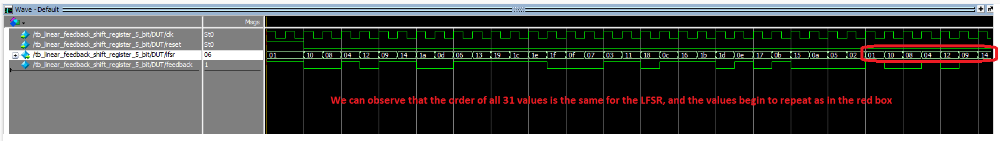 

Top DDS:
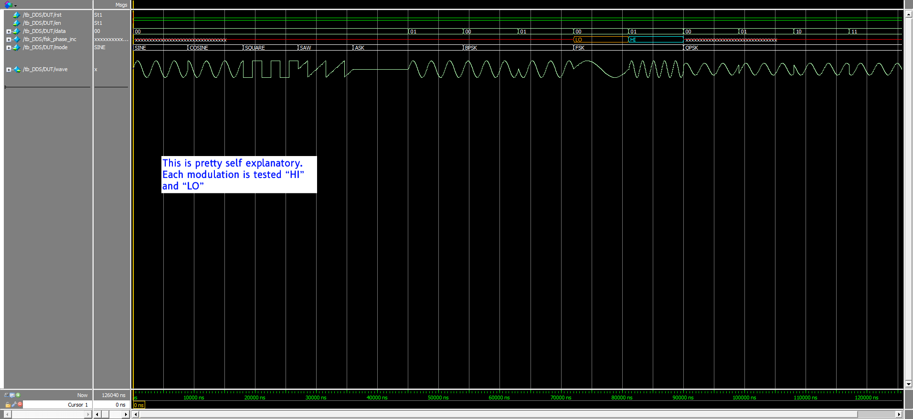 

Bottom DDS:
 

Synchronizers:

Clk sync:
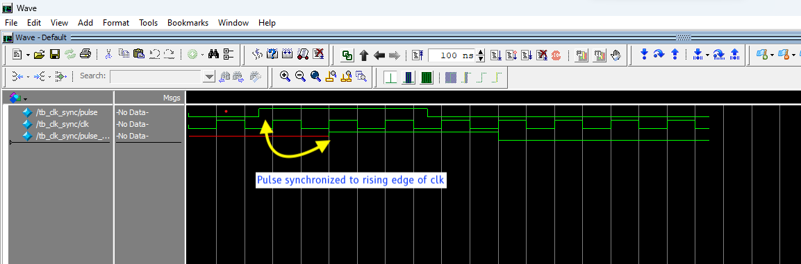 

Fast-to-slow:
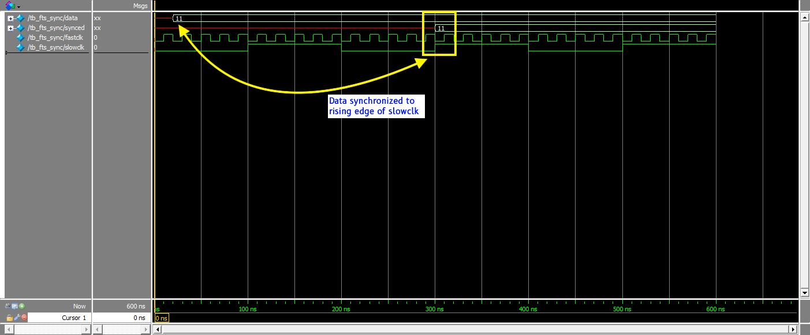 

Slow-to-fast:
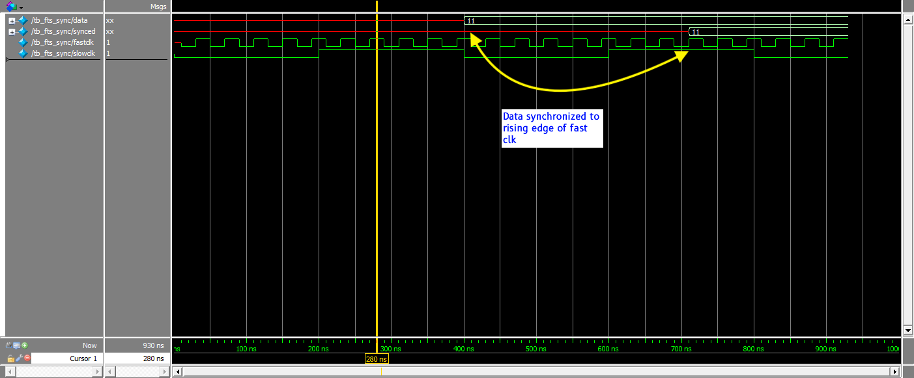 

## Annotated SignalTap screenshots
[./docs](./docs)  

LFSR:
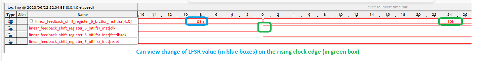 

Top DDS:
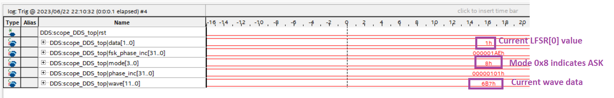 
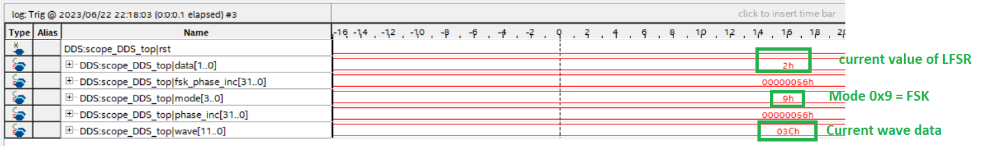 
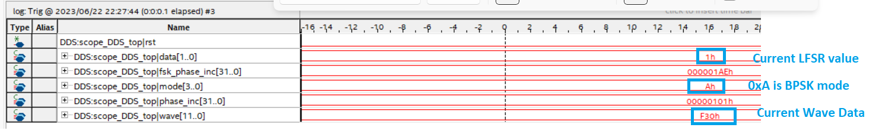 
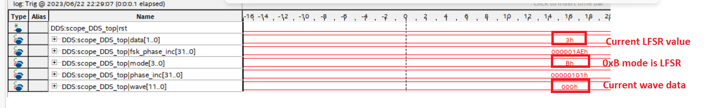 
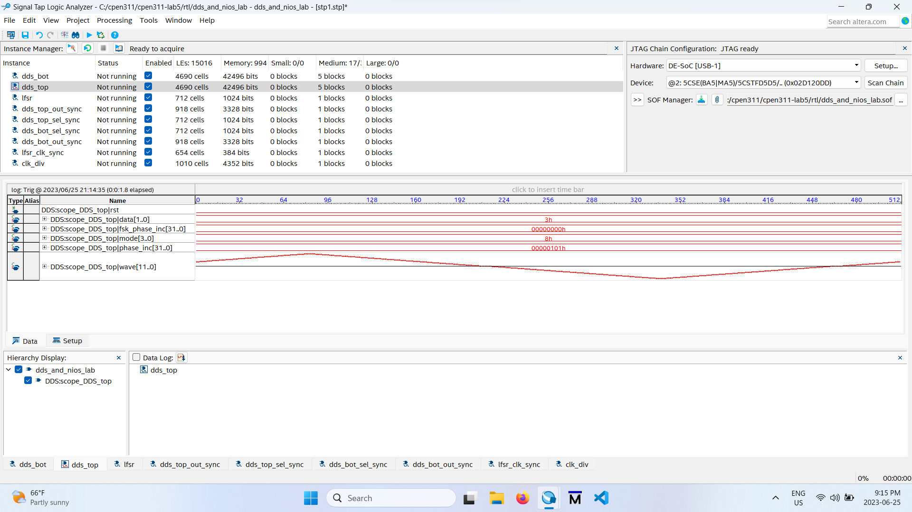

Bottom DDS:
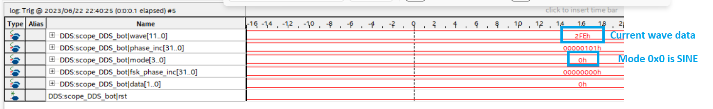 
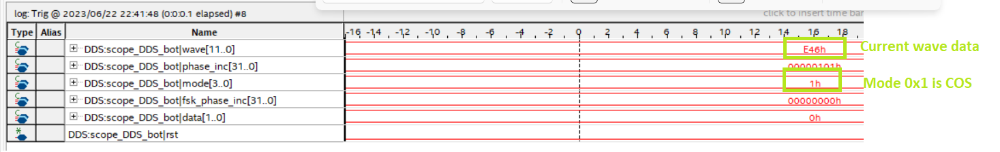 
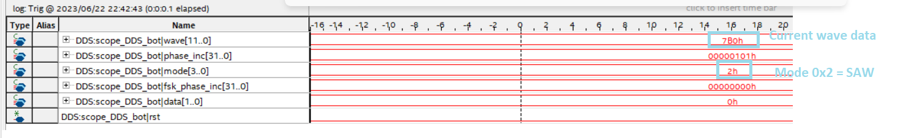 
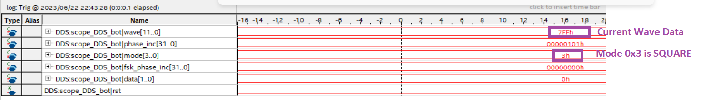 
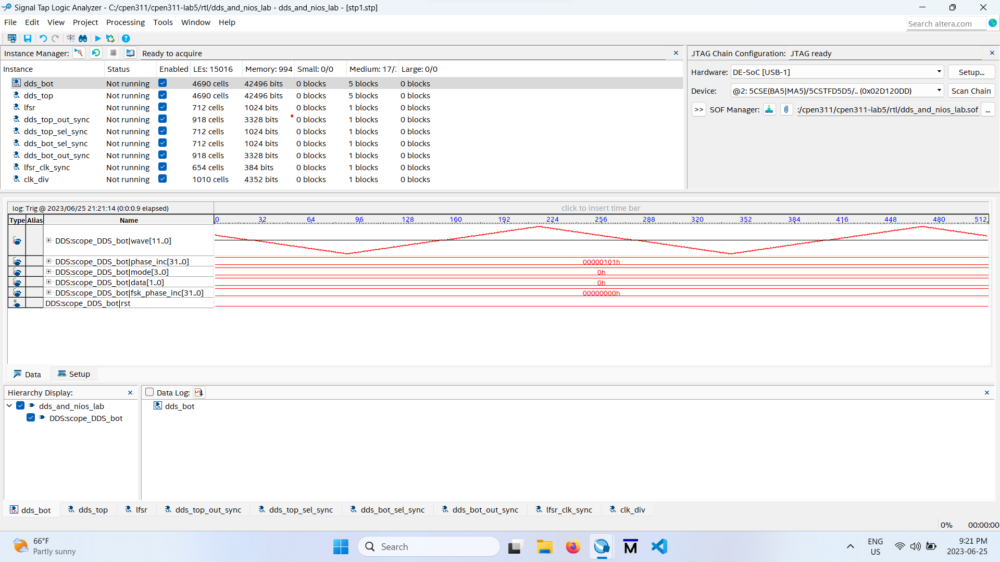

Synchronizers:

Clk sync:
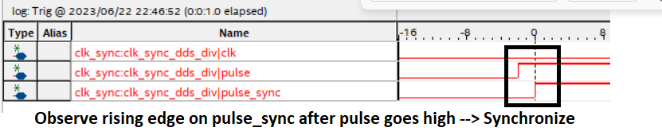 

DDS Top Out Sync:
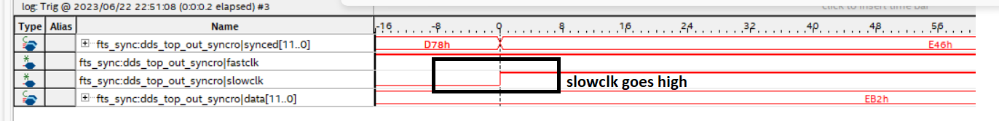 

DDS Top Sel Sync:
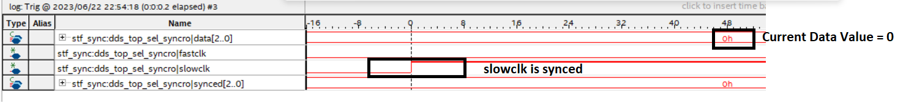 

DDS Bottom Out Sync:
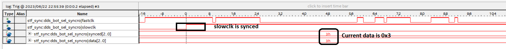 

DDS Bottom Sel Sync:
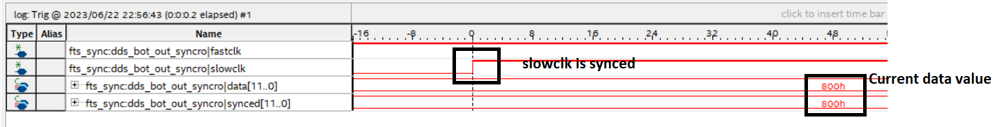 

## Additional Information
None
